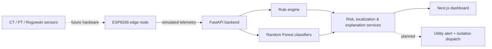

# GridSenti

> AI-assisted detection and localization of invisible high-impedance downed conductors — turning a fault current too small for conventional protection to see into an evidence-backed utility alert.

<p>
  <a href="https://github.com/Kiran8112006/GridSenti"><strong>Repository</strong></a>
  ·
  <a href="https://github.com/Kiran8112006/GridSenti/issues">Issues</a>
  ·
  <a href="https://doi.org/10.17632/rvypj5rs5b.1">Training dataset</a>
  ·
  <a href="#safety-notice">Safety notice</a>
</p>


## The problem

A downed conductor doesn't always trip a breaker. A high-impedance fault (HIF) can draw a fault current small or irregular enough that conventional overcurrent protection never notices — the line stays energized, invisible to the grid's own protection system, but lethal to anyone who touches it. GridSenti exists to close that detection gap: distributed edge telemetry, a hybrid rule-engine + ML classifier, and a control-room dashboard that turns raw waveform anomalies into a ranked, explainable safety response before a person finds the fault by accident.

## What this prototype demonstrates

| Dashboard surface | Demonstrates |
| --- | --- |
| Grid Operations Center (`/`) | Live node fleet status, composite risk score, 8-class fault prediction, feeder topology schematic, software isolation simulation |
| Monitoring Nodes (`/nodes`) | Per-node inventory, communication-state resilience, heartbeat-timeout detection |
| Faults & Safety Response (`/faults`) | Hybrid rule-engine + Random Forest HIF detection with evidence-backed explanations |
| Active Alerts (`/alerts`) | Severity-ranked alerts, safety protocol guidance, isolation recommendations |
| Edge Telemetry Monitor (`/telemetry`) | Raw DWT energy feature vectors (EA / EB / EC) and per-packet classification, replayed from a public dataset |

## Architecture



Solid edges are wired and running today; dotted edges are the real-world path this prototype is built to grow into — physical current/voltage sensors feeding the same detection pipeline, and a dispatch step that turns a confirmed HIF into an actual utility isolation action instead of a simulated one.

## Current prototype vs. the target system

| | Today | Target |
| --- | --- | --- |
| Sensing | ESP8266 replaying a public fault dataset | CT / PT / Rogowski coil hardware on live feeders |
| Detection | Rule engine + Random Forest (binary + 8-class), trained on the Mendeley HIF dataset | Same pipeline, calibrated on field data |
| Localization | Single-node identification | Multi-point section triangulation |
| Response | Software-simulated isolation & public warning | Utility SCADA/relay integration |
| State | In-memory, resets on restart | Persistent store |

> ⚠️ **No physical electrical sensors are connected.** All telemetry the ESP8266 sends is simulated — it demonstrates the edge-node communication architecture only. See [Safety notice](#safety-notice).

## Repository structure

```
GridSenti/
├── frontend/       # Next.js dashboard
├── backend/        # FastAPI backend + ML pipeline
├── esp/            # ESP8266 firmware (PlatformIO)
├── README.md
└── .gitignore
```

## Run it locally

**Frontend** — dashboard at `http://localhost:3000`

```bash
cd frontend
npm install
npm run dev
```

**Backend** — API at `http://localhost:8000`, docs at `http://localhost:8000/docs`

```bash
cd backend
python -m venv .venv
./.venv/Scripts/pip install --prefer-binary -r requirements.txt numpy pandas joblib scikit-learn   # .venv/bin/pip on macOS/Linux
./.venv/Scripts/python -m uvicorn app.main:app --reload --port 8000                                 # .venv/bin/python on macOS/Linux
```

Verify both are talking to each other:

```bash
curl http://localhost:8000/api/health
```

See the sub-directory READMEs for hardware-specific setup:

- [Frontend](./frontend/README.md)
- [Backend](./backend/README.md)
- [ESP Firmware](./esp/README.md)

## Roadmap

- [x] Next.js dashboard — 5 live views (dashboard, nodes, faults, alerts, telemetry)
- [x] FastAPI backend with in-memory state, heartbeat timeout, alerts & event timeline
- [x] ESP8266 firmware wired end-to-end — simulated telemetry → detection → dashboard
- [x] Random Forest binary HIF classifier + 8-class fault classifier, trained on the Mendeley HIF dataset
- [x] Rule engine + composite risk scoring + software isolation simulation + public warning simulation
- [ ] Real CT / PT / Rogowski coil sensor integration
- [ ] Persistent data store (currently in-memory, resets on restart)
- [ ] True multi-point section fault localization (currently node-level only)
- [ ] Production-grade utility alerting & mobile notifications
- [ ] Field-deployed multi-node network validation

## Safety notice

This repository concerns electrical infrastructure concepts. The current build operates entirely on **simulated telemetry** — there is no physical sensing hardware anywhere in this prototype.

**Never connect any prototype hardware directly to:**

- Mains electricity (120 V / 230 V)
- 11 kV, 22 kV, or 33 kV distribution lines
- Any dangerous or high-voltage source

## Dataset & license

The ML models are trained on the public Mendeley fault dataset (Vinayagam, A., 2025, *Fault data set*, Mendeley Data, V1, [doi:10.17632/rvypj5rs5b.1](https://doi.org/10.17632/rvypj5rs5b.1)) — please cite it if you build on this work. This repository is an unlicensed hackathon prototype; review authentication, authorization, and safety requirements before any production or field use.

## Theme

Renewable / Sustainable Energy — Hackathon Project
